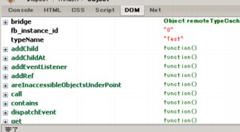
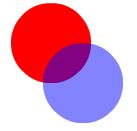

JavaScript から Flash を操作できるツール、Flex-Ajax Bridge (FABridge) を試してみました。

名前に Flex や Ajax とついていますが、Flex や Ajax にしばったライブラリではなく、JavaScript から SWF を操作できる、と考えたほうがよい感じです。

必要なファイルは SWF に組み込む `FABridge.as` と HTML でインクルードする `FABridge.js` の２つです。ダウンロード方法はちょっとややこしいので最後で説明します。

SWFの準備
=========

まずは、SWF 側の実装。bridge フォルダに `FABridge.as` を置きます。AS3.0 です。

```actionscript
// Test.as
package
{
    import flash.display.Sprite;
    import bridge.FABridge;

    public class Test extends Sprite
    {
        public function Test():void
        {
            var _bridge:FABridge = new FABridge();
            _bridge.rootObject = this;

            var s:Sprite = new Sprite();
            s.graphics.beginFill(0xff0000, 1);
            s.graphics.drawCircle(50, 50, 50);
            s.graphics.endFill();
            addChild(s);
        }
    }
}
```

重要なのはコンストラクタの中の最初の２行。`FABridge` のインスタンスを作って、`rootObject` を設定してます。これをしないと、JavaScript から操作できません。

HTMLの準備
==========

```html
<head>
<script src="swfobject.js"></script>
<script src="FABridge.js"></script>
<script>
window.onload = function()
{
    var so = new SWFObject("Test.swf", "movie", "400", "300", "9", "#ffffff");
    so.write("container");
}
</script>
</head>
<body>
    <div id="container"></div>
</body>
```

Flash の埋め込みに SWFObject を使ってますが、普通に HTML で埋め込んでも OK です。SWF 側で登録が完了すると、`FABridge.flash` 経由で SWF にアクセスできます。なお、登録完了イベントは次のようにすれば受け取れます。

```javascript
FABridge.addInitializationCallback("flash", function()
{
    // 処理
});
```

Firebug でいじってみる
======================

ここからは Firebug のコンソールから実験してみます。

まずは root へのアクセス。Test.as で rootObject に代入したオブジェクトを取得します。root 関数を使えば OK。

```javascript
var root = FABridge.flash.root();
```

`root` の中を見てみます。コンソールに `root` と入力し、Firebug の DOM タブで見てみます。

<center></center>

スバラシス。`Test` クラスのメソッドがそのまま定義されてます。さらに、プロパティも完璧。例えば、`x` というプロパティには、`getX()`・`setY()` という関数が用意されます。


プロパティの変更
----------------

さっそく子供の `Sprite` をいじってみます。

```javascript
var child = root.getChildAt(0);
child.setX(10);
```

`getChildAt()` で `Sprite` を取得して、`setX()` で `x` プロパティをいじります。即座に位置が変わります。たのしー。

この処理は ActionScript だと次のソースに対応してます。

```actionscript
var child:Sprite = root.getChildAt(0);
child.x = 10;
```

インスタンスの作成
------------------

`create()` 関数でインスタンスを作れます。

```javascript
var s = FABridge.flash.create("flash.display.Sprite");
s.getGraphics().beginFill(0x0000ff, 0.5);
s.getGraphics().drawCircle(100, 100, 50);
s.getGraphics().endFill();
root.addChild(s);
```

`Sprite` を新たに追加して、円が描画されます。

<center></center>

ActionScript でいうと次のソースに対応してます。

```actionscript
var s:Sprite = new Sprite();
s.graphics.beginFill(0x0000ff, 0.5);
s.graphics.drawCircle(100, 100, 50);
s.graphics.endFill();
root.addChild(s);
```

イベントハンドラの登録
----------------------

イベントとして JavaScript の関数を登録することも簡単。

```javascript
s.addEventListener("click", function(){alert('clicked')});
```

クリックしたら alert 関数が呼ばれます。

まとめるよ
==========

* JavaScript から SWF をいじれる。
* デバッグ時に、外部からパラメータを簡単にいじれるんじゃね？
* ドキュメントは <a href="http://www.adobe.com/jp/devnet/flex/articles/framework_beta_fabridge.html">Flexデベロッパーセンターの記事</a> ぐらい。もっと知りたきゃソース嫁。


FABridge のダウンロード
=======================

Adobe Labs の <a href="http://labs.adobe.com/wiki/index.php/Flex_Framework:FABridge">Flex-Ajax Bridge</a> からできていたようなのですが、LiveCycle Data Services 2.5 beta の一部に組み込まれてからは直接ダウンロードできないようです。

<a href="http://flexapps.macromedia.com/labs/fabridge/samples/srcview/fabridge.zip">ここ</a> からサンプルも含めて一括ダウンロードできますが、念のため辿り着いた方法を書いておきます。

  1. FABridge のページからもリンクされている <a href="http://flexapps.macromedia.com/labs/fabridge/samples/FABridgeSample.html">Flex-AJAX Bridge Example</a> を開く
  2. 右側の Flash で右クリックして [View Source] を選ぶ
  3. 左下フレームの Download source をクリックする