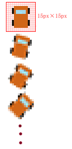
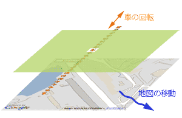

[Google Mapsで鈴鹿サーキット試走](./1/) で使っているテクニックを紹介します。

ゲームのソースを見てみてください。なんと、JavaScript 部分は70行ほどです。かなり少ないですよね。たった、70行でゲームを作れてしまうのは、これから説明するような単純な方法で実装しているからなんです。


実は動いていない車
==================

ゲームをプレイしているといかにもドライブしているような感覚になりますが、実は車は回転するだけで、車の表示位置は変わっていません。動いているのは背景の地図だけなのです。

車の表示位置は動いていないのに、走っている感覚になるんですね。こういう表現って、8ビットゲーム機時代にはよくありました。たとえば、スーパーマリオでも、マリオが全速力で走っているときは、マリオの画面中の表示位置は変わらないまま、背景が動いているだけでした。

では、車はどうやって回転させているのでしょう。


バッファリング方式で回転する車
==============================

車は回転にあわせて１パターンごとに15度ずつ回転させた24種類の画像を用意しました。24種類ものファイルをサーバー上に置くということは、ページを１回開くごとに、サーバーへのアクセスが少なくとも24回発生してしまうということになります。これではサーバーの負荷となりかねません。

そこで、24種類の車を縦に並べて、<a href="1/car.gif">１つの縦長の画像</a>にしてしまいました。

<center></center>

これで、24種類の車の回転パターンを一度にダウンロードすることができます。

１枚の長い画像をどうやって回転しているように見せているかというと、この画像を 15px×15px の `div` タグの中に格納してます。

```html
<style>
#car
{
    width: 15px; height: 15px;
    overflow: hidden;
    z-index:99;
}
</style>
<div id="car"></div>
```

これで、車１つ分だけが 15px×15px の `div` タグから顔を出すことになります。

たとえば、車の画像を `15px` 上にずらせば、車が 15 度分だけ傾きます。`30px` 上にずらせばさらに 15 度傾きます。同様にして、 n ×15 度回転させるには次のようにしています。

```javascript
document.getElementById("car").childNodes[0].style.top = (n * -15) + "px";
```

これで車が回転しているように見えるわけです。

<center></center>

昔の２Ｄゲームでは、裏バッファにキャラクタのアニメーション素材を用意しておいて、それを順次、表の画面に出力してアニメーションしているように見せていました。ここでも、その手法を踏襲しつつ、サーバーの負荷を転送量を抑えることに成功しているわけです。
